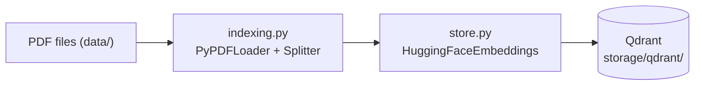
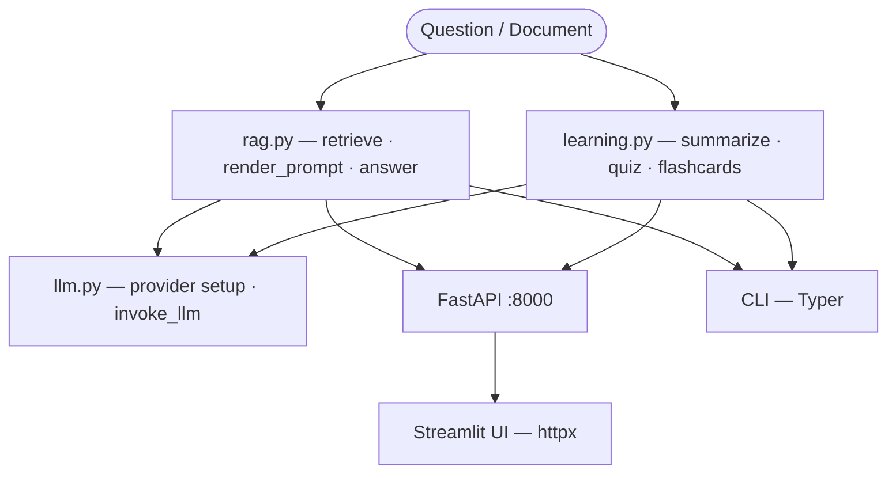

# RAG for Learning System


> A local Retrieval-Augmented Generation pipeline for studying PDF documents.
> Generates grounded answers, summaries, quizzes, and flashcards.

## Table of Contents

- [Features](#features)
- [Architecture](#architecture)
- [Quick Start](#quick-start)
- [Configuration](#configuration)
- [CLI Reference](#cli-reference)
- [HTTP API](#http-api)
- [Streamlit UI](#streamlit-ui)
- [Evaluation](#evaluation)
- [LLM Providers](#llm-providers)
- [Project Structure](#project-structure)


## Features

- Grounded Q&A with inline source citations `[S1]`, `[S2]`
- Document summarization — single-shot or staged map/reduce for long inputs
- Multiple-choice quiz generation with answers, explanations, and difficulty tags
- Flashcard generation for spaced repetition
- Metadata filtering by filename(s), page, section, or document ID
- Vietnamese output across all LLM responses
- JSON and Markdown export for all learning outputs
- Three LLM backends: local HuggingFace (default), vLLM, and Google Gemini
- Interactive web UI (Streamlit) — calls FastAPI backend via HTTP
- REST API (FastAPI) for programmatic access — Swagger UI at `/docs`


## Architecture

<details>
<summary><b>Ingest pipeline</b></summary>



</details>

<details>
<summary><b>Query pipeline</b></summary>



</details>

<details>
<summary><b>Layer responsibilities</b></summary>

| File | Responsibility |
|------|---------------|
| `src/config.py` | Pydantic `BaseSettings` for runtime parameters |
| `src/schemas.py` | Pydantic models for all inputs and outputs |
| `src/filters.py` | Shared metadata filter normalization for API/UI/RAG |
| `src/store.py` | `@lru_cache` singletons: Qdrant client, embeddings, vector store |
| `src/rag.py` | Retrieval, prompt rendering, grounded answer assembly |
| `src/llm.py` | LLM provider construction and invocation |
| `src/learning.py` | Summarize (map/reduce), quiz, flashcard generation |
| `src/export.py` | Single export entrypoint for JSON / Markdown output |
| `src/interfaces/` | CLI (Typer), API (FastAPI), UI (Streamlit via HTTP) |
| `src/evaluation/` | Offline Ragas evaluation and chunking experiments |
| `src/prompts/` | Jinja2 prompt templates |

</details>


## Quick Start

<details open>
<summary><b>Install with uv (recommended)</b></summary>

```bash
# 1. Install dependencies
uv sync

# 2. Configure secrets (Gemini only — skip if using local HF/vLLM)
cp .env.example .env

# 3. Place PDFs in ./data/, then ingest
uv run rag ingest

# 4. Ask a question via CLI
uv run rag ask "What is LoRA fine-tuning?"

# 5. Web UI — start API first, then Streamlit
uv run rag-api &
uv run streamlit run src/interfaces/ui.py   # http://localhost:8501
```

</details>

<details>
<summary><b>Install with pip</b></summary>

```bash
python -m venv .venv
source .venv/bin/activate

python -m pip install -U pip
python -m pip install -r requirements.txt

# Configure secrets (Gemini only)
cp .env.example .env

# Ingest PDFs from ./data/
python -m src.interfaces.cli ingest

# Ask a question
python -m src.interfaces.cli ask "What is LoRA fine-tuning?"

# API + UI
python -m src.interfaces.api &
streamlit run src/interfaces/ui.py          # http://localhost:8501
```

</details>


## Configuration

All runtime parameters live in `src/config.py`. The `.env` file is for secrets only (`GOOGLE_API_KEY`).

<details>
<summary>Full settings reference</summary>

| Setting | Default | Description |
|---|---|---|
| `llm_provider` | `hf_local` | `"hf_local"` / `"gemini"` / `"vllm"` |
| `hf_model` | Qwen3-4B-Instruct | Local path or HuggingFace model ID |
| `hf_device` | `1` | `-1` = CPU, `0+` = CUDA device index |
| `hf_max_new_tokens` | `2048` | Max tokens to generate |
| `llm_temperature` | `0.1` | Generation temperature |
| `embedding_model` | GreenNode VN Mixed | HuggingFace embedding model |
| `top_k` | `5` | Default retrieval chunk count |
| `chunk_size` | `1000` | Characters per chunk |
| `chunk_overlap` | `150` | Overlap between adjacent chunks |
| `summarize_batch_size` | `10` | Chunks per map-reduce batch |
| `summarize_retrieval_k` | `12` | Chunks retrieved for summarization |
| `generation_retrieval_k` | `16` | Chunks retrieved for quiz/flashcards |
| `quiz_default_count` | `8` | Default number of quiz items |
| `flashcards_default_count` | `15` | Default number of flashcards |
| `api_url` | `http://localhost:8000` | Backend URL used by the Streamlit UI |

</details>


## CLI Reference

All learning commands (`summarize`, `quiz`, `flashcards`) share these scoping flags:

| Flag | Description |
|---|---|
| `-d, --document FILENAME` | Target a specific indexed PDF |
| `-q, --query TEXT` | Retrieval guided by topic or question |
| `-f, --filter key=value` | Arbitrary metadata filter (repeatable) |
| `--k N` | Override retrieval top-k |
| `-o, --output PATH` | Write output to file instead of stdout |
| `--format text\|json\|md` | Output format (default: `text`) |

With no scope options, commands run over the entire corpus.

<details>
<summary><b>rag ingest</b> — Index PDFs into Qdrant</summary>

```bash
uv run rag ingest
uv run rag ingest --recreate        # drop and rebuild the collection
```

</details>

<details>
<summary><b>rag ask</b> — Grounded Q&A</summary>

```bash
uv run rag ask "What is RLHF?"
uv run rag ask "Explain reward modeling" --k 8
uv run rag ask "What is on page 3?" -f filename="paper.pdf" -f page=3
```

If no relevant context is found, the system replies in Vietnamese indicating insufficient context.

</details>

<details>
<summary><b>rag summarize</b> — Study-oriented summaries</summary>

Automatically switches to map/reduce when chunk count exceeds `summarize_batch_size`.

```bash
uv run rag summarize --document "paper.pdf"
uv run rag summarize --query "LoRA fine-tuning" --k 12
uv run rag summarize -d paper.pdf -o exports/summary.md --format md
```

</details>

<details>
<summary><b>rag quiz</b> — Multiple-choice quiz generation</summary>

Produces structured items with answer, explanation, difficulty, topic tag, and source markers.

```bash
uv run rag quiz --document "paper.pdf" --count 10
uv run rag quiz --query "reward model training" -n 6 --format json -o exports/quiz.json
uv run rag quiz -f filename="paper.pdf" -f page=3 -n 4
```

</details>

<details>
<summary><b>rag flashcards</b> — Spaced-repetition flashcards</summary>

Each card includes front, back, optional hint, topic tag, and source markers.

```bash
uv run rag flashcards --document "paper.pdf" --count 20
uv run rag flashcards --query "PEFT methods" -n 12 --format md -o exports/cards.md
```

</details>

<details>
<summary><b>rag debug-retrieval</b> — Inspect raw retrieval results</summary>

Shows scores, metadata, and chunk previews without calling the LLM.

```bash
uv run rag debug-retrieval "attention mechanism"
uv run rag debug-retrieval "GPT pretraining" --k 10 --json
```

</details>


## HTTP API

<details>
<summary>FastAPI endpoints and example requests</summary>

```bash
uv run rag-api
# hot-reload for development:
uv run uvicorn src.interfaces.api:app --host 0.0.0.0 --port 8000 --reload
```

Swagger UI: [http://localhost:8000/docs](http://localhost:8000/docs)

| Method | Path | Purpose |
|--------|------|---------|
| GET | `/health` | Liveness probe |
| GET | `/documents` | List indexed documents (filename, pages, chunk counts) |
| POST | `/upload` | Upload and ingest a single PDF (multipart/form-data) |
| POST | `/ask` | Grounded Q&A with citations |
| POST | `/summarize` | Study-oriented summary (document / query / filter) |
| POST | `/quiz` | Multiple-choice quiz generation |
| POST | `/flashcards` | Flashcard generation |

<details>
<summary>Example request bodies</summary>

```jsonc
// POST /ask
{ "question": "What is RLHF?", "k": 6, "filters": { "filename": "paper.pdf" } }

// POST /summarize
{ "document": "paper.pdf", "query": "LoRA", "k": 12 }

// POST /quiz
{ "document": "paper.pdf", "count": 8 }

// POST /flashcards
{ "query": "PEFT methods", "count": 12 }
```

</details>
</details>


## Streamlit UI

<details>
<summary>Local web interface for study sessions</summary>

The UI calls the FastAPI backend via HTTP. Start the API before launching the UI.

```bash
uv run rag-api &
uv run streamlit run src/interfaces/ui.py   # http://localhost:8501

# Custom API URL
RAG_API_URL=http://localhost:8000 uv run streamlit run src/interfaces/ui.py
```

Features:

- Upload PDFs (auto-ingested into Qdrant via API)
- Select an indexed document, optionally filter by page
- Chat-style Q&A with source/citation panel and chunk previews
- Card-by-card flashcard study mode with flip interaction
- Interactive quiz with radio answers, scoring, and per-question feedback
- Export results as JSON or Markdown
- Session-scoped chat history inside the Q&A tab

</details>


## Evaluation

<details>
<summary>Offline chunking evaluation with Ragas</summary>

The repo includes a benchmark runner at `src/evaluation/run_chunking_eval.py`. It:

- loads test cases from `src/evaluation/benchmark_rag.csv`
- re-ingests the corpus into a separate Qdrant collection per chunking strategy
- runs Ragas evaluation with `llm_provider="vllm"`
- writes per-strategy JSON artifacts and a comparison CSV under `artifacts/eval/chunking/`

```bash
uv run python src/evaluation/run_chunking_eval.py
uv run python src/evaluation/run_chunking_eval.py --test-path src/evaluation/benchmark_rag.csv
```

Make sure a vLLM server is running first if you keep the default evaluation provider.

</details>


## LLM Providers

| Provider | `llm_provider` | Requires |
|---|---|---|
| Local HuggingFace | `hf_local` (default) | — |
| vLLM (OpenAI-compatible) | `vllm` | vLLM server running on `vllm_api_base` |
| Google Gemini | `gemini` | `GOOGLE_API_KEY` in `.env` |

<details>
<summary>vLLM setup</summary>

1. Start the vLLM OpenAI-compatible server (port 8001 to avoid conflict with FastAPI on 8000):

```bash
CUDA_VISIBLE_DEVICES=1 uv run python -m vllm.entrypoints.openai.api_server \
    --model /mnt/pretrained_fm/Qwen_Qwen3-4B-Instruct-2507 \
    --port 8001 --dtype bfloat16 --gpu-memory-utilization 0.8 \
    --max-model-len 32768 --trust-remote-code
```

2. For evaluation or benchmarking, set `llm_provider = "vllm"` (or pass an override in evaluation scripts) and ensure `vllm_api_base` points to the server in `src/config.py`.

</details>

<details>
<summary>Local HuggingFace setup</summary>

Set `hf_model` to a local path or model ID, `hf_device` to your CUDA index (or `-1` for CPU).

Generation parameters (`max_new_tokens`, `temperature`, `do_sample`) are applied directly to the pipeline's `generation_config` after construction to avoid deprecation warnings.

</details>

<details>
<summary>Google Gemini setup</summary>

1. Set `llm_provider = "gemini"` in `src/config.py`
2. Add your key to `.env`:

```env
GOOGLE_API_KEY=your-api-key-here
```

The model name is controlled by `gemini_model` in `src/config.py`.

</details>

## Project Structure

```
src/
├── config.py           # BaseSettings runtime configuration
├── schemas.py          # Pydantic models for all outputs
├── filters.py          # Shared metadata filter normalization
├── store.py            # Embeddings singleton + Qdrant client
├── indexing.py         # PDF loading, chunking, ingestion
├── rag.py              # Retrieval, prompting, grounded answers
├── llm.py              # LLM provider setup and invocation
├── learning.py         # Summarize, quiz, flashcard generation
├── export.py           # JSON / Markdown export helper
├── prompts/            # Jinja2 templates — edit to change LLM behaviour
├── evaluation/         # Offline Ragas evaluation (runner, metrics, chunking)
└── interfaces/
    ├── api.py          # FastAPI app — thin HTTP layer
    ├── cli.py          # Typer CLI — 6 commands
    ├── ui.py           # Streamlit UI — calls API via HTTP
    └── styles.py       # Custom CSS for the Streamlit app
data/                   # Input PDFs
storage/qdrant/         # On-disk vector store (not committed)
```
