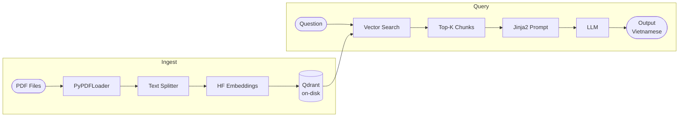

# RAG for Learning System


> A local Retrieval-Augmented Generation pipeline for studying PDF documents.
> Generates grounded answers, summaries, quizzes, and flashcards.


## Table of Contents

- [Features](#features)
- [Architecture](#architecture)
- [Quick Start](#quick-start)
- [Configuration](#configuration)
- [CLI Reference](#cli-reference)
- [LLM Providers](#llm-providers)
- [Project Structure](#project-structure)


## Features

- Grounded Q&A with inline source citations `[S1]`, `[S2]`
- Document summarization — single-shot or staged map/reduce for long inputs
- Multiple-choice quiz generation with answers, explanations, and difficulty tags
- Flashcard generation for spaced repetition
- Metadata filtering by filename, page, section, or any indexed field
- Vietnamese output across all LLM responses
- JSON and Markdown export for all learning outputs
- Two LLM backends: local HuggingFace (default) and Google Gemini


## Architecture




## Quick Start

```bash
# 1. Install dependencies
uv sync

# 2. Configure secrets  (Gemini only — skip if using local HF)
cp .env.example .env

# 3. Place PDFs in ./data/, then ingest
uv run rag ingest

# 4. Ask a question
uv run rag ask "What is LoRA fine-tuning?"
```


## Configuration

All runtime parameters live in `src/config.py`. The `.env` file is for secrets only (`GOOGLE_API_KEY`).

<details>
<summary>Full settings reference</summary>

| Setting | Default | Description |
|---|---|---|
| `llm_provider` | `hf_local` | `"hf_local"` or `"gemini"` |
| `hf_model` | Qwen3-4B-Instruct | Local path or HuggingFace model ID |
| `hf_device` | `1` | `-1` = CPU, `0+` = CUDA device index |
| `hf_max_new_tokens` | `2048` | Max tokens to generate |
| `llm_temperature` | `0.1` | Generation temperature |
| `embedding_model` | GreenNode VN Mixed | HuggingFace embedding model |
| `top_k` | `5` | Default retrieval chunk count |
| `chunk_size` | `1000` | Characters per chunk |
| `chunk_overlap` | `150` | Overlap between adjacent chunks |
| `summarize_batch_size` | `10` | Chunks per map-reduce batch |
| `summarize_retrieval_k` | `12` | Chunks retrieved for summarization |
| `generation_retrieval_k` | `16` | Chunks retrieved for quiz/flashcards |
| `quiz_default_count` | `8` | Default number of quiz items |
| `flashcards_default_count` | `15` | Default number of flashcards |

</details>


## CLI Reference

All learning commands (`summarize`, `quiz`, `flashcards`) share these scoping flags:

| Flag | Description |
|---|---|
| `-d, --document FILENAME` | Target a specific indexed PDF |
| `-q, --query TEXT` | Retrieval guided by topic or question |
| `-f, --filter key=value` | Arbitrary metadata filter (repeatable) |
| `--k N` | Override retrieval top-k |
| `-o, --output PATH` | Write output to file instead of stdout |
| `--format text\|json\|md` | Output format (default: `text`) |

With no scope options, commands run over the entire corpus.


<details>
<summary><strong>rag ingest</strong> — Index PDFs into Qdrant</summary>

```bash
uv run rag ingest
uv run rag ingest --recreate        # drop and rebuild the collection
```

</details>

<details>
<summary><strong>rag ask</strong> — Grounded Q&A</summary>

```bash
uv run rag ask "What is RLHF?"
uv run rag ask "Explain reward modeling" --k 8
uv run rag ask "What is on page 3?" -f filename="paper.pdf" -f page=3
```

If no relevant context is found, the system replies:
> "Tôi không có đủ thông tin trong ngữ cảnh được cung cấp để trả lời."

</details>

<details>
<summary><strong>rag summarize</strong> — Study-oriented summaries</summary>

Automatically switches to map/reduce when chunk count exceeds `summarize_batch_size`.

```bash
uv run rag summarize --document "paper.pdf"
uv run rag summarize --query "LoRA fine-tuning" --k 12
uv run rag summarize -d paper.pdf -o exports/summary.md --format md
```

</details>

<details>
<summary><strong>rag quiz</strong> — Multiple-choice quiz generation</summary>

Produces structured items with answer, explanation, difficulty, topic tag, and source markers.

```bash
uv run rag quiz --document "paper.pdf" --count 10
uv run rag quiz --query "reward model training" -n 6 --format json -o exports/quiz.json
uv run rag quiz -f filename="paper.pdf" -f page=3 -n 4
```

</details>

<details>
<summary><strong>rag flashcards</strong> — Spaced-repetition flashcards</summary>

Each card includes front, back, optional hint, topic tag, and source markers.

```bash
uv run rag flashcards --document "paper.pdf" --count 20
uv run rag flashcards --query "PEFT methods" -n 12 --format md -o exports/cards.md
```

</details>

<details>
<summary><strong>rag debug-retrieval</strong> — Inspect raw retrieval results</summary>

Shows scores, metadata, and chunk previews without calling the LLM.

```bash
uv run rag debug-retrieval "attention mechanism"
uv run rag debug-retrieval "GPT pretraining" --k 10 --json
```

</details>


## LLM Providers

| Provider | `llm_provider` | Requires |
|---|---|---|
| Local HuggingFace | `hf_local` (default) | — |
| Google Gemini | `gemini` | `GOOGLE_API_KEY` in `.env` |

<details>
<summary>Local HuggingFace setup</summary>

Set `hf_model` to a local path or model ID, `hf_device` to your CUDA index (or `-1` for CPU).

Generation parameters (`max_new_tokens`, `temperature`, `do_sample`) are applied directly to the pipeline's `generation_config` after construction to avoid deprecation warnings from passing them alongside `generation_config`.

</details>

<details>
<summary>Google Gemini setup</summary>

1. Set `llm_provider = "gemini"` in `src/config.py`
2. Add your key to `.env`:

```env
GOOGLE_API_KEY=your-api-key-here
```

The model name is controlled by `gemini_model` in `src/config.py`.

</details>


## Project Structure

```
src/
├── cli.py          # Typer CLI — 6 commands
├── config.py       # Frozen Settings dataclass — all runtime params
├── export.py       # JSON / Markdown serialization
├── indexing.py     # PDF loading, chunking, ingestion
├── learning.py     # Summarize, quiz, flashcard generation
├── rag.py          # Retrieval, prompting, LLM abstraction
├── schemas.py      # Pydantic models for all outputs
├── store.py        # Embeddings singleton + Qdrant client
└── prompts/        # Jinja2 templates — edit to change LLM behaviour
data/               # Input PDFs
storage/qdrant/     # On-disk vector store (not committed)
```